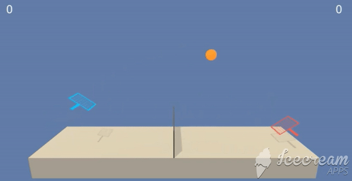

# deep_reinforcement_tennis_project
Project 3 of Udacity's Deep Reinforcement Learning nanodegree program

## Project Details
The aim of this project is to train two agents to control rackets to bounce a ball over a net. If an agent hits the ball over the net, it receives a reward of +0.1. If an agent lets a ball hit the ground or hits the ball out of bounds, it receives a reward of -0.01. Thus, the goal of each agent is to keep the ball in play.

- The observation space consists of 8 variables corresponding to the position and velocity of the ball and racket.  
- Each agent receives its own, local observation.  
- Two continuous actions are available, corresponding to movement toward (or away from) the net, and jumping.

The task is episodic, and in order to solve the environment, your agents must get an average score of +0.5 (over 100 consecutive episodes, after taking the maximum over both agents).

## Getting Started
Following libraries are required:
Python 3.x , Jupyter Notebook, NumPy, matplotlib, PyTorch, UnityEnvironment

Following are the steps for getting started with the project:  

### Step 1: Activate the Environment
Please follow the instructions in the [DRLND GitHub repository's](https://github.com/udacity/deep-reinforcement-learning/tree/master/p3_collab-compet) README.md to set up your Python environment. By following these instructions, you will install PyTorch, the ML-Agents toolkit, and a few more Python packages required to complete the project.

(For Windows users) The ML-Agents toolkit supports Windows 10. While it might be possible to run the ML-Agents toolkit using other versions of Windows, it has not been tested on other versions. Furthermore, the ML-Agents toolkit has not been tested on a Windows VM such as Bootcamp or Parallels.  

Once the environment is set, then place the file in the  p3_collab-compet/ folder in the DRLND GitHub repository, and unzip (or decompress) the file.

(For AWS) If you'd like to train the agent on AWS (and have not enabled a virtual screen), then please use this link (version 1) or this link (version 2) to obtain the "headless" version of the environment. You will not be able to watch the agent without enabling a virtual screen, but you will be able to train the agent. (To watch the agent, you should follow the instructions to enable a virtual screen, and then download the environment for the Linux operating system above.)

## Instructions
Apart from the main Tennis.ipynb file, there are following two additional files which are used in the project:
- model.py: where a neural network is defined using PyTorch and
- ddpg_agent_main: where Deep Deterministic Policy Gradients (DDPG) algorithm is defined.

