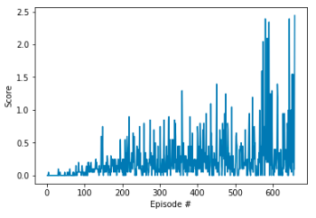

#  Project Report

## Learning Algorithm  
Deep Deterministic Policy Gradients (DDPG) algorithm is used in this project as it is highly suitable for solving the continous control problems. Also, as mentioned [here](https://keras.io/examples/rl/ddpg_pendulum/#:~:text=Deep%20Deterministic%20Policy%20Gradient%20(DDPG)%20is%20a%20model%2Dfree,algorithm%20for%20learning%20continous%20actions.&text=It%20uses%20Experience%20Replay%20and,operate%20over%20continuous%20action%20spaces.), DDPG combines the intelligence from both DPG (Deterministic Policy Gradient) and DQN (Deep Q-Network). 
  
## Implementation
As mentioned [here](https://spinningup.openai.com/en/latest/algorithms/ddpg.html) Deep Deterministic Policy Gradient (DDPG) is an algorithm which concurrently learns a Q-function and a policy. In addition, It uses off-policy data and the Bellman equation to learn the Q-function, and uses the Q-function to learn the policy.  
Also, The neural network used in the project contains two hidden layers of size 800 and 600 respectively for both critic and actor networks. ReLU activation function is used for the hidden layers and tanh function is used for the final output layer.  
Gradient Clipping was later added to the update of Critic network to further improve the performance.  
In addition, the code was modified to update the networks less aggresively -> 10 times after every 5 timesteps.

Following hyperparameters are used for learning:  
~~~
BUFFER_SIZE = int(1e6)  # replay buffer size
BATCH_SIZE = 512        # minibatch size
GAMMA = 0.99            # discount factor
TAU = 1e-1              # for soft update of target parameters
LR_ACTOR = 1e-4         # learning rate of the actor 
LR_CRITIC = 1e-3        # learning rate of the critic
~~~

##  Plot of Rewards
  
The Average score (over 100 episodes) of +0.51! was achieved at episode: 658. 

##  Ideas for Future Work  
- Hyper parameters and different network architures can be explored further to improve the agent's learning speed.
- Trust Region Policy Optimization (TRPO), Truncated Natural Policy Gradient (TNPG) and Proximal Policy Optimization (PPO) can be investigated and implemented for improving the performance.
